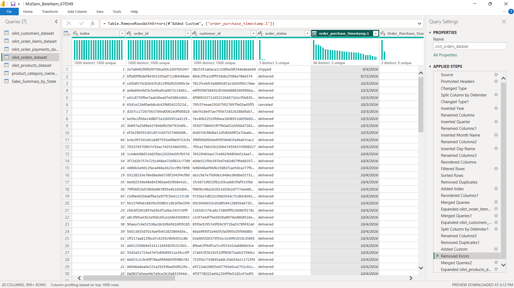
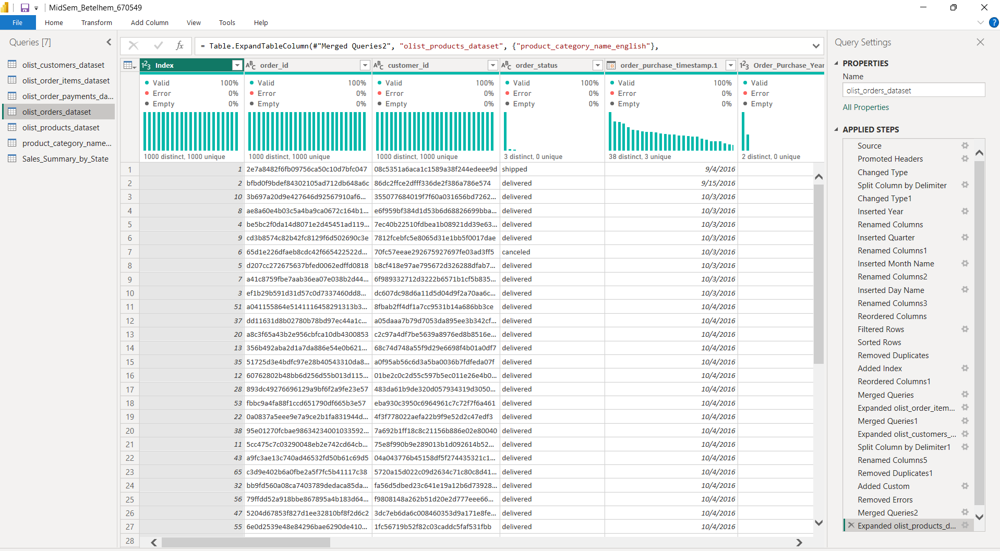
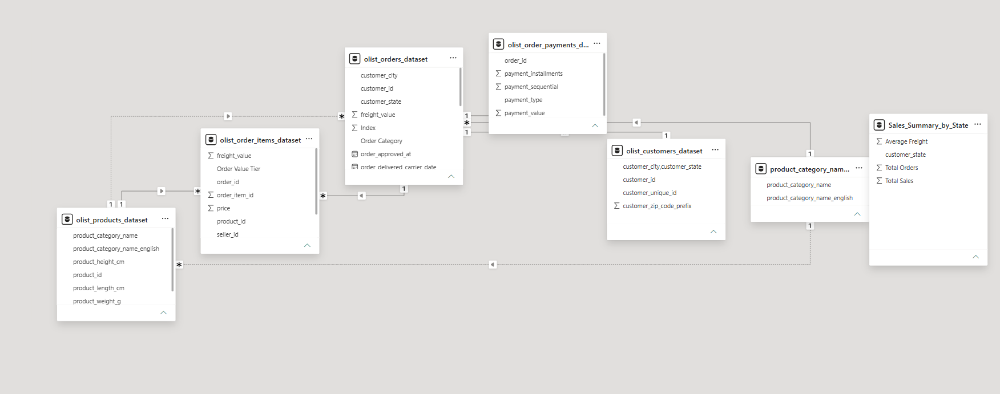
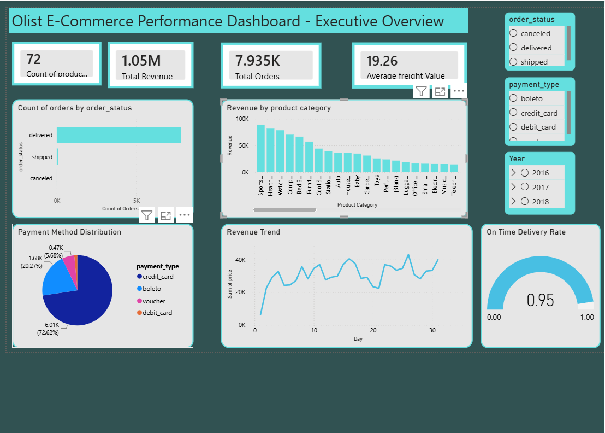
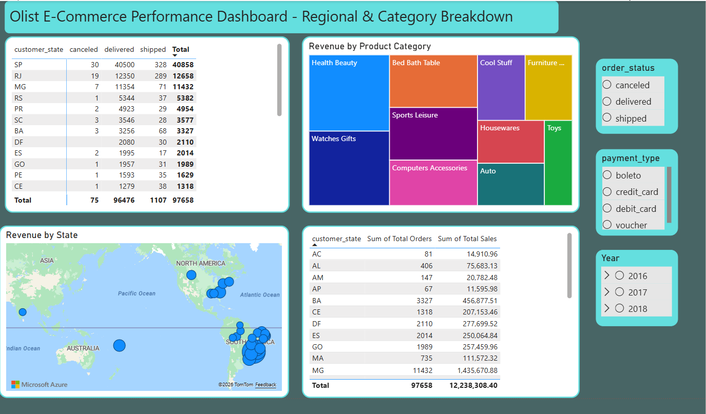
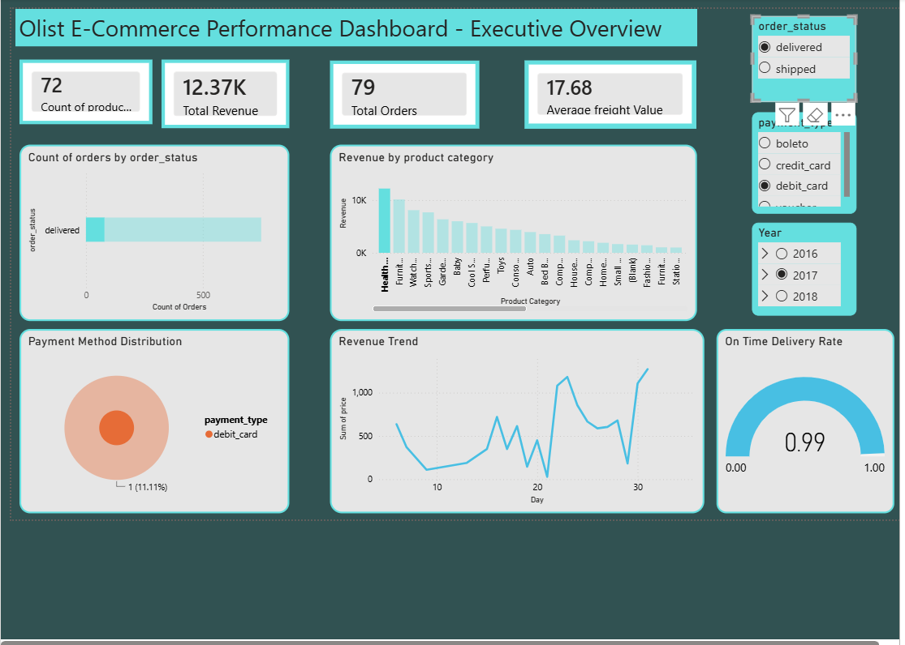
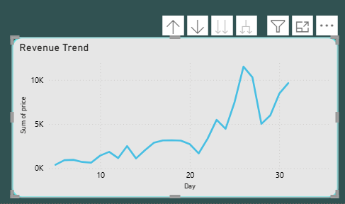

# DSA 3050A - Business Intelligence & Visualization
## Mid-Semester Practical Examination

**Student Name:** Betelhem Getachew Kebede
**Student ID:** 670549

---

## 1. Dataset Source

**Dataset:** Brazilian E-Commerce Public Dataset by Olist
**Source:** Kaggle - [https://www.kaggle.com/datasets/olistbr/brazilian-ecommerce](https://www.kaggle.com/datasets/olistbr/brazilian-ecommerce)

This is a genuine, real-world e-commerce dataset published by Olist, a Brazilian online marketplace. It was downloaded directly from Kaggle without any modification, fabrication, or row-count inflation. Six of the original files were used:

| File | Rows | Columns | Purpose |
|---|---|---|---|
| `olist_orders_dataset.csv` | 99,441 | 8 | Order dates, order status, customer link |
| `olist_customers_dataset.csv` | 99,441 | 5 | Customer location (city, state) |
| `olist_order_items_dataset.csv` | 112,650 | 7 | Price, freight value, product link |
| `olist_order_payments_dataset.csv` | 103,886 | 5 | Payment type, installments, payment value |
| `olist_products_dataset.csv` | 32,951 | 9 | Product category and attributes |
| `product_category_name_translation.csv` | 71 | 2 | Portuguese-to-English category name mapping |

Merging all the files together comfortably exceed the minimum requirement of 10,000 rows and 10 columns.

---

## 2. Business Problem Being Analyzed

Olist connects small Brazilian retailers with major marketplaces. As a Business Intelligence Analyst, the objective was to clean, transform, and model the raw multi-table order data, then build a Power BI dashboard to help management understand:

- Overall sales and order volume performance
- Which product categories and regions drive the most revenue
- Customer payment behavior
- Delivery performance and reliability
- Where geographic or category-based growth opportunities exist

---

## 3. Power Query Transformations Performed

All transformations were performed in Power Query before loading data into the Power BI model. Screenshots for each step are provided in the `/Screenshots` folder, numbered to match the order below.

### A. Basic Data Cleaning

| Step | Transformation | Screenshot | Details |
|---|---|---|---|
| 1 | Raw Imported Dataset | `1.raw_imported_dataset.png` | Data as it appeared immediately after import, before any Power Query transformation |
| 2 | Power Query Editor (Source step) | `2.Power_query_editor.png` | Power Query Editor opened on the Source step, before cleaning began |
| 3 | Rename Columns | `3.Rename_columns.png` | Renamed unclear/misspelled columns in the Products table (e.g. `product_name_lenght` → `product_name_length`) |
| 4 | Change Data Types | `4.Change_data_types.png` | Corrected column data types — date columns (Orders) changed from Text to Date, numeric columns (price, freight_value, payment_value) changed to Decimal Number |
| 5 | Remove Duplicates | `5.Remove_Duplicates.png` | Selected all columns and applied Remove Duplicates across relevant queries |
| 6 | Remove Blank Rows | `6.Remove_blank_rows.png` | Removed fully blank rows using Home → Remove Rows → Remove Blank Rows |
| 7 | Trim Text | `7.Trim_text.png` | Applied Trim to remove leading/trailing whitespace from text columns such as `customer_city` |
| 8.1 | Replace Inconsistent Values (Find and Replace) | `8.1Replace_inconsistent_values(find and replace).png` | Used Replace Values to handle the `not_defined` placeholder in `payment_type`, converting it to a proper missing-value treatment |
| 8 | Replace Inconsistent Values (Capitalization) | `8.Replace_Inconsistent_values(Capaitalization).png` | Applied Capitalize Each Word formatting to category and status fields to standardize presentation-layer text |
| 9 | Remove Unnecessary Columns | `9. Remove Unnecessary Columns.png` | Removed columns not needed for analysis from the Products table (`product_name_length`, `product_description_length`, `product_photos_qty`) |

### B. Intermediate Transformations

| Step | Transformation | Screenshot | Details |
|---|---|---|---|
| 10 | Split Column | `10. Split_Columns.png` | Split `order_purchase_timestamp` into separate Date and Time columns using Split Column → By Delimiter (Space) |
| 11 | Merge Columns | `11. Merge_Columns.png` | Merged `customer_city` and `customer_state` into a combined `City_State` column |
| 12 | Custom Column | `12. Custom_Column.png` | Created a custom calculated column, `Total Item Value = [price] + [freight_value]`, to represent the true cost of each order line including shipping |
| 13 | Conditional Column | `13. Conditional_Column.png` | Created a conditional column classifying orders (e.g. High Value / Low Value based on price threshold) |
| 14 | Extracting Year | `14. Extracting_Year.png` | Extracted the Year from `order_purchase_timestamp` using Add Column → Date → Year |
| 15 | Extracting Quarter | `15. Extracting_Quarter.png` | Extracted the Quarter using Add Column → Date → Quarter → Quarter of Year |
| 16 | Extracting Name of the Month | `16. Extracting_Name_of_the_Month.png` | Extracted the Month Name using Add Column → Date → Month → Name of Month |
| 17 | Extracting Name of the Day | `17. Extracting_name_of_the_day.png` | Extracted the Day Name using Add Column → Date → Day → Name of Day |
| 18 | Filter by 3 Conditions | `18. Filter_by_3_Conditions.png` | Filtered rows using multiple simultaneous conditions (e.g. order status and date/price thresholds), exceeding the minimum 2-condition requirement |
| 19 | Sorting Values | `19. Sorting_Values.png` | Sorted the dataset by `order_purchase_timestamp` in ascending order for chronological analysis |
| 20 | Adding an Index Column | `20. Adding_an_Index_Column.png` | Added a sequential Index Column starting from 1 for unique row identification |

### C. Advanced Power Query Tasks

| Step | Transformation | Screenshot | Details |
|---|---|---|---|
| 21 | Merging Orders and Order Items Queries | `21. Merging_Orders_and_OrderItems_Queries.png` | Merged the Orders query with the Order Items query on `order_id` (Left Outer Join), bringing price and freight_value into the order-level data |
| 22 | Merging Orders and Customer Queries | `22. Merging_Order_and_Customer_Queries.png` | Merged in the Customers query on `customer_id`, bringing in customer city and state |
| 23 | Nested Conditional Logic | `23. Nested_Conditional_logic.png` | Created an `Order_Category` custom column using nested if/else-if/else logic combining order status and delivery performance into categories (e.g. on-time vs. late delivered orders) |
| 24 | Remove Errors | `24. Remove_Errors.png` | Identified and removed rows that produced data type conversion errors (e.g. failed date conversions) using Remove Errors |
| 25 | Creating Reference Query | `25. Creating_Reference_Query.png` | Created a Reference Query from the main cleaned query to build an independent, linked summary table without duplicating the full dataset |
| 26 | Group By with Multiple Aggregations | `26. Groupby_with_multiple_Aggregations.png` | Applied Group By on the Reference Query using multiple simultaneous aggregations (Sum of price, Count of orders, Average of freight value) grouped by state |
| 27 | Group By Results | `27. Groupby_Results.png` | Final aggregated output showing total sales, total orders, and average freight cost per customer state |

### Applied Steps Evidence (Per Query)

To provide complete transformation history across the data model, Applied Steps screenshots were captured for each individual query:

| Screenshot | Query |
|---|---|
| `a. AppliedSteps_MergedQuery.png` | Main merged query (Orders + Order Items + Customers) |
| `b. AppliedSteps_Customer_Query.png` | Customers query |
| `c. AppliedSteps_OrderItems_Query.png` | Order Items query |
| `d. AppliedSteps_OrderPayments_Query.png` | Order Payments query |
| `e. AppliedSteps_Products_Query.png` | Products query |
| `f. AppliedSteps_NameTranslation_Query.png` | Category Name Translation query |
| `g. AppliedSteps_Reference_Query.png` | Reference Query (used for Group By summary) |



### Column Profiling

| Screenshot | Details |
|---|---|
| `Column_Profile.png` | Column Quality, Column Distribution, and Column Profile enabled under the View tab, with profiling set to the entire dataset. Used to identify missing values (e.g. in delivery dates and product category), and to confirm distinct vs. total row counts when checking for duplicates |



---

## 4. Data Model

The data model uses a combination of:
- **Direct merges in Power Query** for the core transactional flow (Orders + Order Items + Customers), producing one consolidated query used for most visuals
- **Relationships in Model view** connecting the remaining tables (Products, Order Payments, Category Translation) to the merged query, avoiding unnecessary processing load from merging every table into a single flat query

This hybrid structure kept the model lightweight while still satisfying the Merge Queries requirement and supporting cross-table analysis (e.g. category names and payment types) through native Power BI relationships.

**Screenshot:** `Model_View_of_the_Data.png` - shows the relationships connecting all tables in Power BI's Model view.



---

## 5. Visuals Created

### Page 1 — Executive Overview



| Visual | Screenshot | Description |
|---|---|---|
| KPI Cards (×3) | `Dashboard.png` | Total Revenue, Total Orders, Average Freight Value |
| Bar Chart | `Dashboard.png` | Count of orders by order status |
| Column Chart | `Dashboard.png` | Sum of price by product category (English names) |
| Gauge | `Dashboard.png` | On-Time Delivery Rate |
| Pie/Donut Chart | `Dashboard.png` | Count of payment type by payment type |
| Line Chart | `Dashboard.png`, `Drill_down_on_a_Line_Graph.png` | Sum of price by day, with drill-down enabled through Year → Quarter → Month |
| Slicers (×3) | `Dashboard.png` | order_status, payment_type, Year |

### Page 2 — Regional & Category Breakdown



| Visual | Screenshot | Description |
|---|---|---|
| Treemap | `Dashboard_page2.png` | Sum of price by product category, filtered to top categories |
| Table | `Dashboard_page2.png` | Order status counts (canceled/delivered/shipped) by customer state |
| Map | `Dashboard_page2.png` | Sum of price by customer state, plotted geographically |
| Matrix/Table | `Dashboard_page2.png` | Sum of Total Orders and Sum of Total Sales by customer state |
| Slicers (×3, synced) | `Dashboard_page2.png` | order_status, payment_type, Year |

### Interactivity Evidence

**Before filtering:**


**After filtering (cross-filtering demonstrated):**


**Drill-down on line chart:**


| Screenshot | Demonstrates |
|---|---|
| `Dashboard_After_Filtering.png` | Cross-filtering: dashboard state after a slicer/visual selection is applied, compared against the default (unfiltered) view in `Dashboard.png` |
| `Drill_down_on_a_Line_Graph.png` | Drill-down functionality on the daily revenue trend line chart |

### Final Cleaned Dataset
| Screenshot | Description |
|---|---|
| `Final_Cleaned_Dataset.png` | The fully cleaned, transformed, and merged dataset as loaded into the Power BI data model |

---

## 6. Business Insights

The Olist E-Commerce Performance Dashboard was built to analyze order, payment, delivery, and revenue data across Brazil's online marketplace, with the goal of identifying patterns that can inform business decision-making. By examining order status, payment behavior, product category performance, and geographic distribution of sales, several clear trends emerge that highlight both the strengths of the current operation and areas with room for strategic improvement.

**1. Revenue is heavily concentrated in a few categories.**
Health & Beauty and Sports & Leisure are the top two product categories by revenue, with a small group of categories (Watches & Gifts, Computers, Cool Stuff) accounting for a disproportionate share of total revenue (R$1.05M). This suggests the business could prioritize marketing spend and inventory investment toward these high-performing categories.

**2. Credit card dominates payment behavior.**
Credit card is by far the preferred payment method, used in 72.62% of transactions (6.01K orders), followed by boleto at 20.27%. Voucher and debit card together make up less than 6% of payments, suggesting the business should ensure credit card processing remains seamless while continuing to support boleto for the meaningful minority who rely on it.

**3. Strong on-time delivery, but regional sales are highly uneven.**
The On-Time Delivery Rate stands at 95%, indicating strong logistics performance overall. However, sales are heavily concentrated geographically — São Paulo (SP) alone accounts for 40,858 of the total ~97,658 orders (roughly 42%), with Rio de Janeiro (RJ) and Minas Gerais (MG) a distant second and third. This suggests significant opportunity to grow market share in underrepresented states.

**Conclusion & Recommendations**

Taken together, these insights point to a business that is operationally strong but geographically and categorically concentrated. The high on-time delivery rate reflects a reliable logistics operation worth maintaining, while the heavy reliance on a small number of product categories and the dominance of São Paulo in overall sales suggest room to diversify. To build on its current strengths, the business should consider expanding marketing efforts in underrepresented states such as Rio de Janeiro and Minas Gerais, exploring growth opportunities in mid-performing product categories beyond Health & Beauty and Sports & Leisure, and continuing to support multiple payment methods — particularly boleto — to maintain accessibility for customers who do not rely on credit cards.

---

## 7. Repository Structure

```
DSA3050A_MidSem_Betelhem_670549/
│
├── Dataset/
│   ├── olist_orders_dataset.csv
│   ├── olist_customers_dataset.csv
│   ├── olist_order_items_dataset.csv
│   ├── olist_order_payments_dataset.csv
│   ├── olist_products_dataset.csv
│   └── product_category_name_translation.csv
│
├── PBIX/
│   └── MidSemExam.pbix
│
├── Screenshots/
│   │
│   ├── 1.raw_imported_dataset.png
│   ├── 2.Power_query_editor.png
│   │
│   ├── AppliedSteps_ScrernShots/
│   │   ├── AppliedSteps_MergedQuery.png
│   │   ├── AppliedSteps_Customer_Query.png
│   │   ├── AppliedSteps_OrderItems_Query.png
│   │   ├── AppliedSteps_OrderPayments_Query.png
│   │   ├── AppliedSteps_Products_Query.png
│   │   ├── AppliedSteps_NameTranslation_Query.png
│   │   └── AppliedSteps_Reference_Query.png
│   │
│   ├── Q1_Basic_Data_Cleaning/
│   │   ├── 3.Rename_columns.png
│   │   ├── 4.Change_data_types.png
│   │   ├── 5.Remove_Duplicates.png
│   │   ├── 6.Remove_blank_rows.png
│   │   ├── 7.Trim_text.png
│   │   ├── 8.1Replace_inconsistent_values(find and replace).png
│   │   ├── 8.Replace_Inconsistent_values(Capaitalization).png
│   │   └── 9.Remove_Unnecessary_Columns.png
│   │
│   ├── Q1_Intermediate_Transformations/
│   │   ├── 10.Split_Columns.png
│   │   ├── 11.Merge_Columns.png
│   │   ├── 12.Custom_Column.png
│   │   ├── 13.Conditional_Column.png
│   │   ├── 14.Extracting_Year.png
│   │   ├── 15.Extracting_Quarter.png
│   │   ├── 16.Extracting_Name_of_the_Month.png
│   │   ├── 17.Extracting_name_of_the_day.png
│   │   ├── 18.Filter_by_3_Conditions.png
│   │   ├── 19.Sorting_Values.png
│   │   └── 20.Adding_an_Index_Column.png
│   │
│   ├── Q1_Advanced_Power_Query/
│   │   ├── 21.Merging_Orders_and_OrderItems_Queries.png
│   │   ├── 22.Merging_Order_and_Customer_Queries.png
│   │   ├── 23.Nested_Conditional_logic.png
│   │   ├── 24.Remove_Errors.png
│   │   ├── 25.Creating_Reference_Query.png
│   │   ├── 26.Groupby_with_multiple_Aggregations.png
│   │   └── 27.Groupby_Results.png
│   │
│   ├── Column_Profile.png
│   ├── Model_View_of_the_Data.png
│   ├── Dashboard.png
│   ├── Dashboard_After_Filtering.png
│   ├── Dashboard_page2.png
│   ├── Drill_down_on_a_Line_Graph.png
│   └── Final_Cleaned_Dataset.png
│
├── README.md
│
└── Insights.pdf
```

---

## 8. Tools Used

- **Power BI Desktop** - data modeling, transformation, and dashboard development
- **Power Query Editor** - ETL (Extract, Transform, Load) process
- **DAX** - calculated measure for On-Time Delivery Rate
